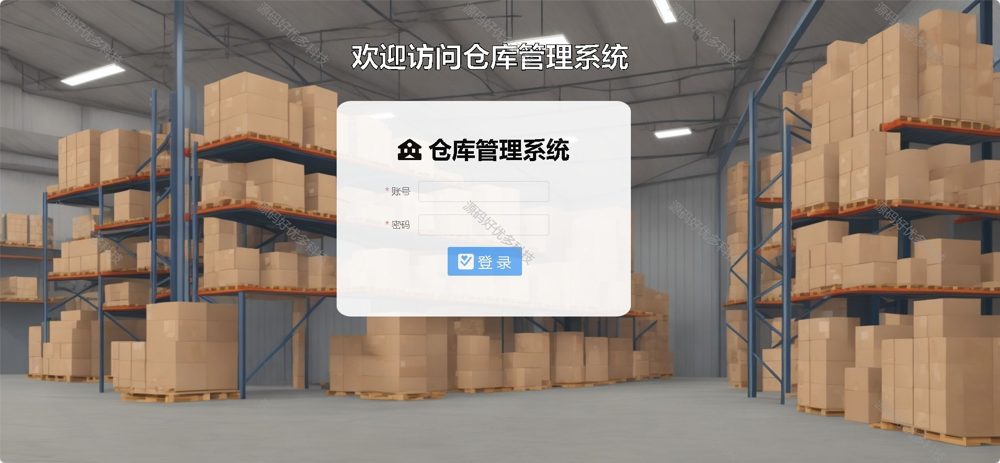
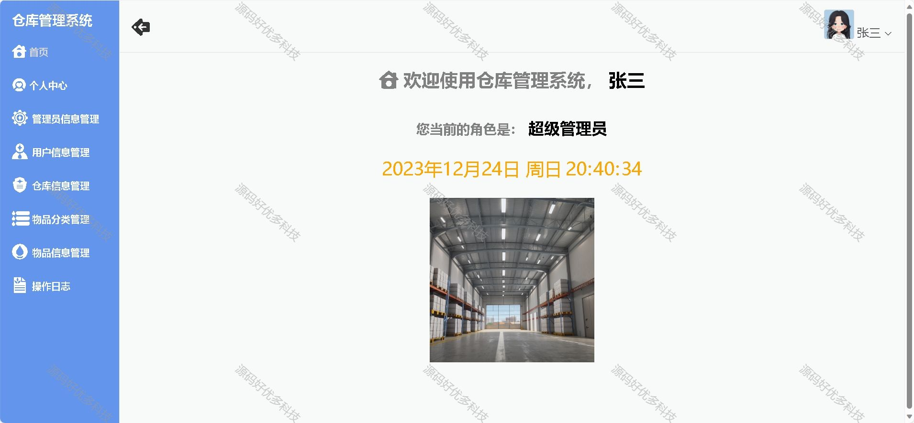
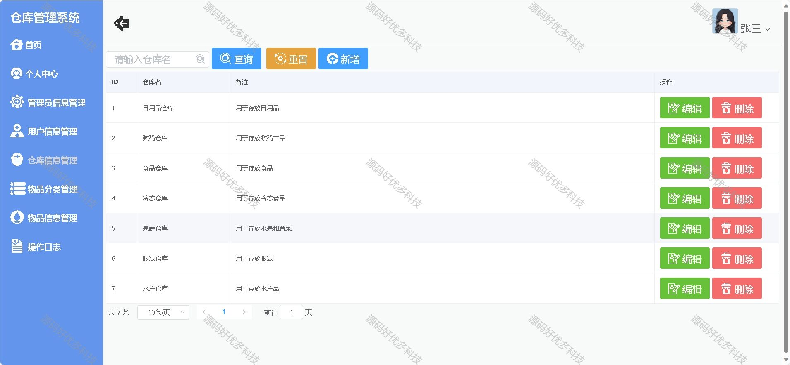
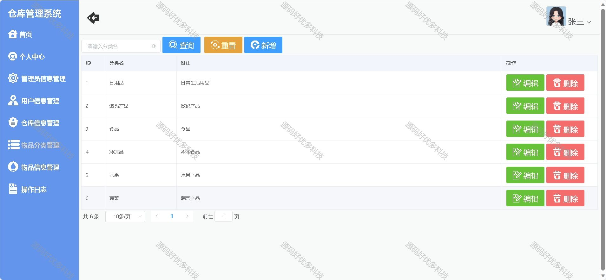
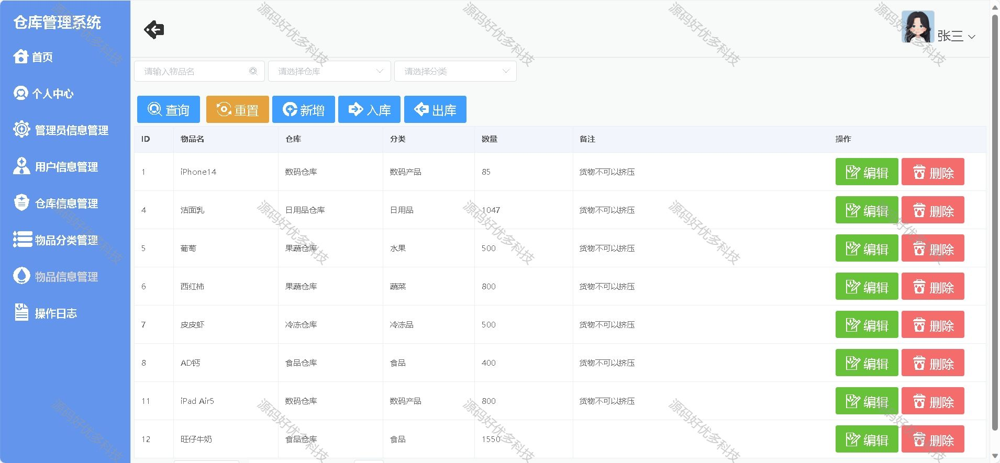
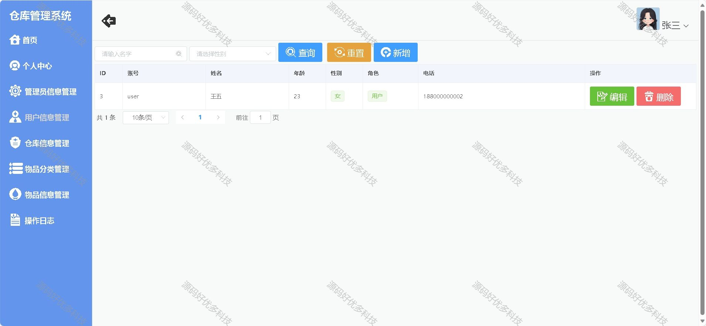
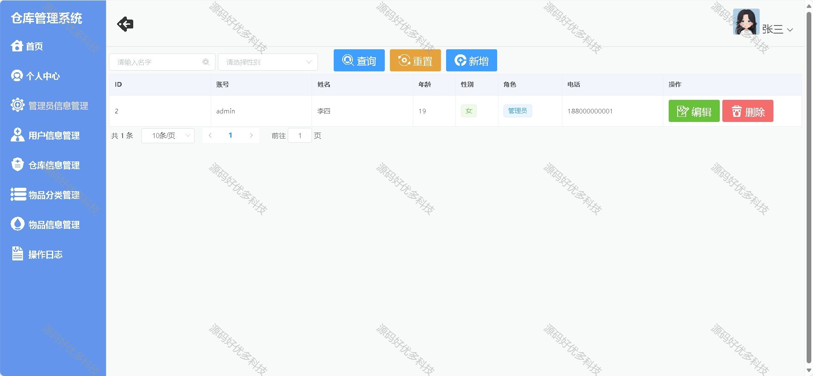
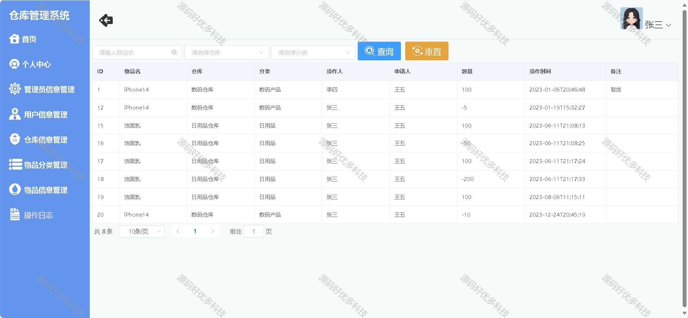
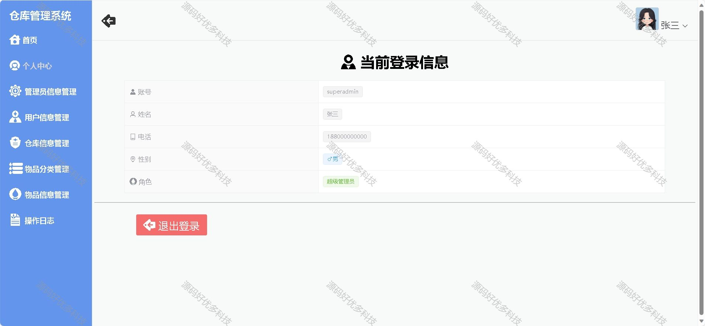
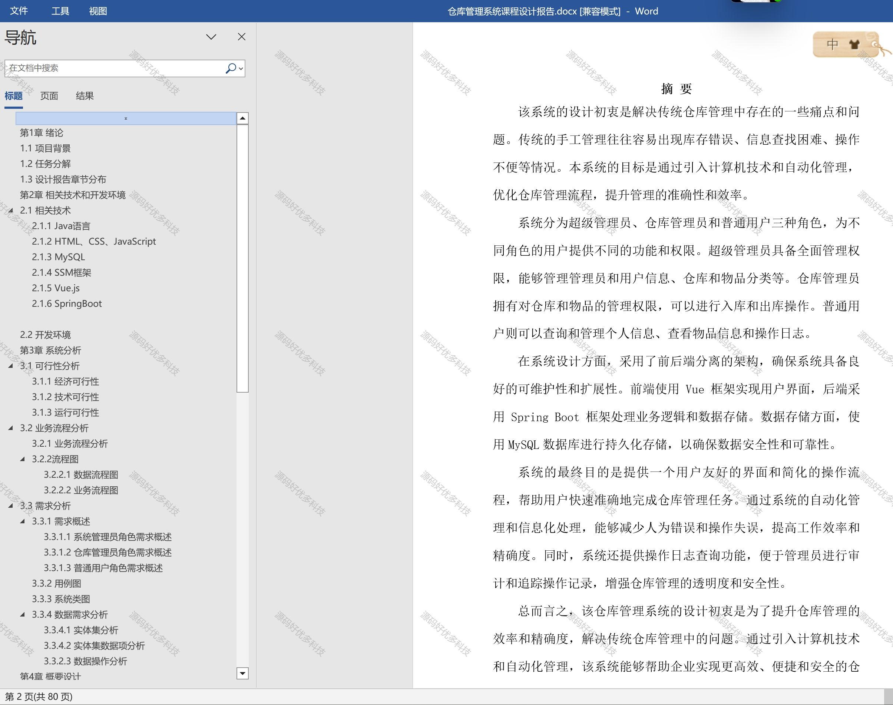

### 一、作品包含

源码+数据库+设计文档+全套环境和工具资源+部署教程

### 二、项目技术

前端技术：Html、Css、Js、Vue、Element-ui

数据库：MySQL

后端技术：Java、Spring Boot、MyBatis

### 三、运行环境

开发工具：IDEA/eclipse

数据库：MySQL8.0

数据库管理工具：Navicat10以上版本

环境配置软件： JDK1.8+Maven3.6.3

前端Nodejs：16

### 四、项目介绍

项目编号：springbootA006

随着全球经济的不断发展和市场竞争的加剧，企业对于仓储和物流管理的要求日益提高。传统的仓储管理方式往往存在一些问题，如库存管理不精确、货物追踪困难、物流流程繁琐等，严重影响了企业的运营效率和客户满意度。
此外电子商务的兴起和全球贸易的增长，仓储操作的规模和复杂性不断增加。准确管理库存水平、确保准时履行订单、优化存储能力等成为了满足客户期望和保持竞争力的关键。传统的手工仓储管理方法不仅耗时，而且容易出错，导致运营效率低下和客户不满
1.系统管理员：通过登录系统后，可以进行管理员和用户信息的管理、仓库和物品分类的管理，以及操作日志的查询，具有全面的系统管理权限。

2.仓库管理员：登录系统后，可以进行仓库和物品分类的管理，同时也能够查询所有用户的操作日志，以便了解仓库的出入库情况和操作记录。

3.普通用户：登录系统后，可以查询和管理个人信息，同时也可以查询物品的详细信息，以及查看自己的操作日志，帮助用户了解自己的出入库操作记录和历史纪录。

### 五、运行截图

